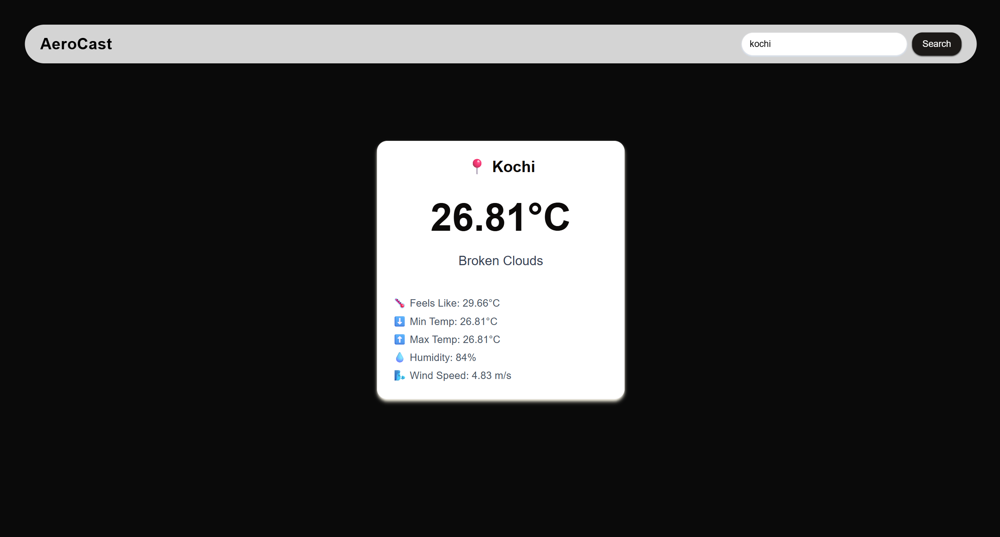

# 🌤️ AeroCast

AeroCast is a sleek and responsive weather forecast application that allows you to search for any city and view its current weather conditions in real-time—built using **React + TypeScript**, styled with **Tailwind CSS** and **ShadCN UI**, and powered by the **OpenWeatherMap API**.

---

## ✨ Features

- 🔍 Search for global cities with autocomplete logic
- 🌡️ Real-time weather display:
  - Current Temperature
  - Feels Like
  - Minimum and Maximum Temperatures
  - Humidity
  - Wind Speed
  - Weather Description
- 🎨 Clean UI with custom styling and Google Fonts
- ⚙️ Context API used for global state management
- 📱 Fully responsive for desktop and mobile

---

## 📸 Screenshot

> The image is stored in `src/assets/screenshot.png`



---

## 🚀 Getting Started

### 1. Clone the Repository

```bash
git clone https://github.com/your-username/aerocast.git
cd aerocast
```
### 2. Install Dependency

```bash
npm i
```

###3. Set up Environment Variables
Create a .env file in the root directory:
```bash
VITE_WEATHER_API_KEY=your_openweathermap_api_key
```

###4.Start Development Server
```bash
npm run dev
```
Your app will run locally 
